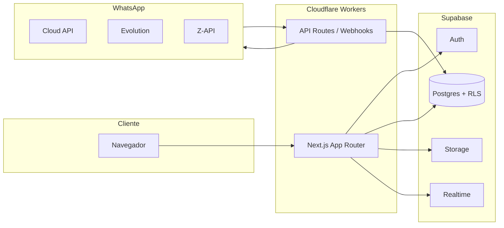

# SolAIre W+ CRM

CRM **multi-tenant** e **white-label** para operações comerciais: leads, kanban, WhatsApp, disparos em massa e dashboard de operações do dia. Construído com **Next.js 15**, **Supabase** e deploy em **Cloudflare Workers**.

<p align="center">
  
  
  
  
</p>

---

## Visão geral

Cada empresa cadastrada opera em um **tenant isolado** (RLS no Postgres): dados, identidade visual, mensagens rápidas e integrações WhatsApp ficam separados. O produto foi pensado para parceiros e times comerciais que precisam de um CRM enxuto, bonito e pronto para demo ou produção.

**Produção:** configure `NEXT_PUBLIC_APP_URL` com a URL do seu Worker Cloudflare.

---

## Principais recursos

### Operação comercial

| Módulo | Descrição |
|--------|-----------|
| **Dashboard** | Central de operações do dia: novos leads, mensagens enviadas, conversas ativas, gráfico por hora, origens, funil e tabela de cadastros (fuso Brasília) |
| **Leads** | CRUD, importação CSV, tags, valor, origem, notas e histórico |
| **Kanban** | Pipeline drag-and-drop com estágios configuráveis e atualização em tempo real |
| **Conversas** | Chat WhatsApp unificado com status de entrega/leitura |
| **Disparos** | Campanhas com templates, segmentação por estágio/origem, prévia de audiência e histórico de envios |
| **Estoque** | Produtos, movimentações e alertas de estoque baixo |

### White-label por empresa

- Upload de **logo** com extração automática de cor (fallback por nome da empresa)
- **Cor da marca** aplicada em menu, botões, hovers e bolhas de chat
- **Mensagens rápidas** editáveis, com modelos prontos e reordenação por arrastar
- Nome e slogan no menu lateral; título da aba do navegador personalizado

### WhatsApp modular

Provedores plugáveis via interface única:

- **Meta Cloud API**
- **Evolution API**
- **Z-API**

Webhook unificado: `POST /api/webhooks/whatsapp/[provider]`

---

## Arquitetura



---

## Stack

- **Frontend:** Next.js 15 (App Router), React 19, Tailwind CSS, componentes estilo shadcn/ui
- **Backend:** Supabase (Postgres, Auth, Storage, Realtime)
- **Deploy:** OpenNext + Wrangler → Cloudflare Workers
- **Libs:** dnd-kit, Recharts, Zod, date-fns, lucide-react

---

## Estrutura do projeto

```
app/
  (auth)/              Login e cadastro
  (app)/               Área autenticada (dashboard, leads, kanban, chat, disparos…)
  api/                 Webhooks WhatsApp, intake de leads, auth
components/
  ui/                  Design system
  app/                 Sidebar, topbar, tema por tenant
  dashboard/           Painel de operações de leads
  settings/            Mensagens rápidas, identidade
lib/
  supabase/            Clientes SSR + tipos
  whatsapp/            Providers e factory
  theme/               Cores da marca e extração da logo
  leads/               Métricas do dashboard
supabase/migrations/   Schema versionado + RLS
middleware.ts          Sessão e rotas públicas
```

Alias de import: `@/*` → raiz do repositório.

---

## Pré-requisitos

- Node.js 20+
- Conta [Supabase](https://supabase.com)
- Conta [Cloudflare](https://dash.cloudflare.com) (para deploy)
- (Opcional) App Meta / Evolution / Z-API para WhatsApp

---

## Configuração local

### 1. Clonar e instalar

```bash
git clone https://github.com/ramosxzz/solairew-crm.git
cd solairew-crm
npm install
```

### 2. Variáveis de ambiente

```bash
cp .env.example .env.local
```

Preencha em `.env.local`:

| Variável | Descrição |
|----------|-----------|
| `NEXT_PUBLIC_SUPABASE_URL` | URL do projeto Supabase |
| `NEXT_PUBLIC_SUPABASE_ANON_KEY` | Chave anon (pública) |
| `SUPABASE_SERVICE_ROLE_KEY` | Service role — **apenas servidor**, nunca no client |
| `WHATSAPP_WEBHOOK_VERIFY_TOKEN` | Token de verificação do webhook Meta |
| `NEXT_PUBLIC_APP_URL` | `http://localhost:3000` em dev |

### 3. Banco de dados (migrations)

Com [Supabase CLI](https://supabase.com/docs/guides/cli):

```bash
npx supabase link --project-ref SEU_PROJECT_REF
npx supabase db push
```

Ou execute os arquivos em `supabase/migrations/` em ordem no **SQL Editor** do Supabase.

### 4. Rodar em desenvolvimento

```bash
npm run dev
```

Acesse [http://localhost:3000](http://localhost:3000).

---

## Deploy (Cloudflare Workers)

**Não coloque chaves em `wrangler.jsonc`** (arquivo versionado). Use variáveis no painel ou secrets:

```bash
cp .dev.vars.example .dev.vars
# Preencha .dev.vars com os valores reais (arquivo ignorado pelo Git)

npm run deploy
```

No [Cloudflare Dashboard](https://dash.cloudflare.com) → Workers → **solaire-w-crm** → Settings → **Variables**, configure:

- `NEXT_PUBLIC_SUPABASE_URL`
- `NEXT_PUBLIC_SUPABASE_ANON_KEY`
- `NEXT_PUBLIC_APP_URL`
- `WHATSAPP_WEBHOOK_VERIFY_TOKEN`

Service role (somente servidor):

```bash
npx wrangler secret put SUPABASE_SERVICE_ROLE_KEY
```

Veja também [SECURITY.md](SECURITY.md).

Build local de preview:

```bash
npm run preview
```

---

## WhatsApp

1. Em **Integrações → WhatsApp**, cadastre o provedor da empresa.
2. Aponte o webhook do provedor para:
   ```
   https://SEU_DOMINIO/api/webhooks/whatsapp/cloud_api
   ```
   (ou `evolution` / `zapi` conforme o provider)
3. Use o mesmo valor de `WHATSAPP_WEBHOOK_VERIFY_TOKEN` na Meta.

**Disparos em massa:** preferir Evolution ou Z-API para texto livre fora da janela de 24h; Cloud API exige templates aprovados pela Meta.

---

## Identidade visual (tenant)

Em **Configurações → Identidade da empresa**:

1. Envie o logo (PNG/JPG/SVG, até 2 MB).
2. A cor é extraída automaticamente; se não for possível, uma sugestão pelo nome é aplicada.
3. Salve — o tema do CRM atualiza para todos os usuários do tenant.

Variáveis CSS injetadas por tenant: `--brand`, `--accent`, `--ring`, bolhas de chat, etc.

---

## Scripts úteis

| Comando | Ação |
|---------|------|
| `npm run dev` | Servidor de desenvolvimento |
| `npm run build` | Build Next.js |
| `npm run deploy` | Build OpenNext + deploy Workers |
| `npm run lint` | ESLint |
| `npm run supabase:types` | Gera tipos TypeScript do schema local |

---

## Segurança

- **RLS** em todas as tabelas tenant-scoped
- Service role só em rotas server-side (webhooks, signup, cron)
- Não commite `.env.local` nem `SUPABASE_SERVICE_ROLE_KEY`
- Buckets de storage com políticas por `tenant_id`

---

## Licença

Projeto privado — uso conforme acordo com os mantenedores do repositório.

---

## Repositório

**GitHub:** [github.com/ramosxzz/solairew-crm](https://github.com/ramosxzz/solairew-crm)

Desenvolvido como chassis operacional **SolAIre W+** para CRM white-label, IA aplicada ao negócio e operações comerciais modernas.
